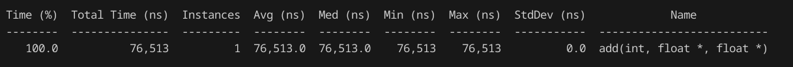

### Repo containing all my cuda programs

## Day-1
Set up cuda using the nvidia toolkit run file and Wrote a hello world cuda program.
## Day-2 
Wrote a kernel to add $10^6$ elements paralelly and profiled the cuda program.
